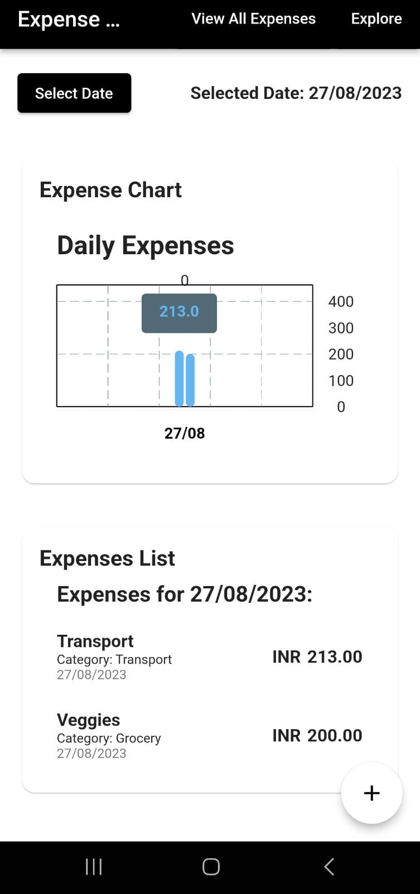
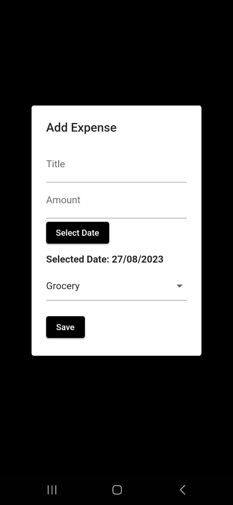
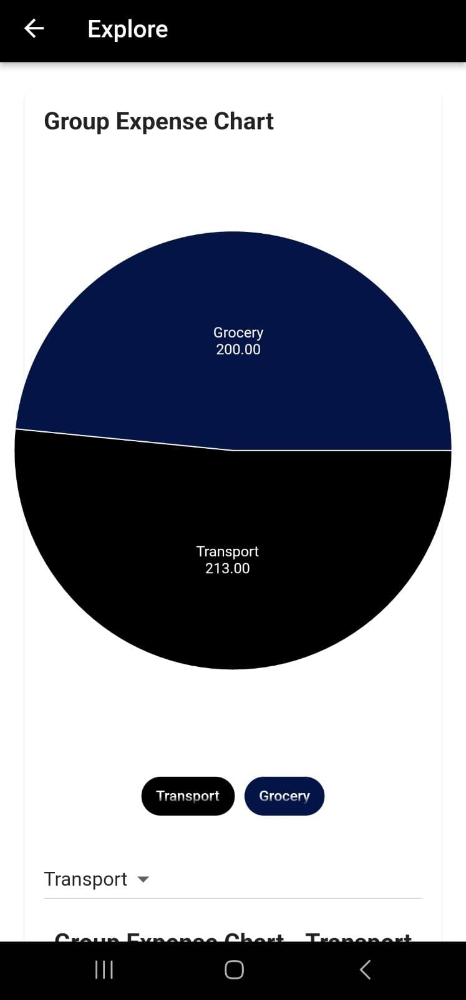
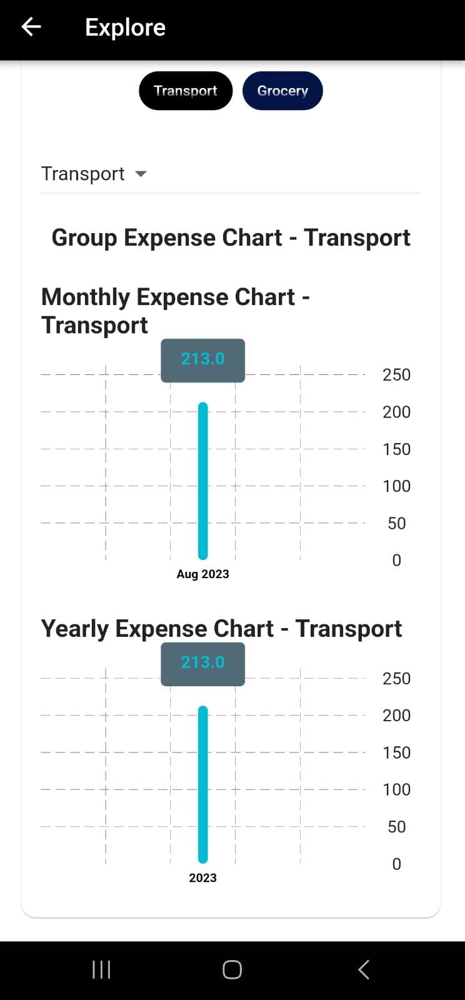

# Expense Explorer

**Expense Explorer** is a Flutter-based mobile application designed to help users manage their budget efficiently. This app allows users to add daily expenses, track their spending, and analyze their financial habits through interactive charts and tables on a daily, monthly, or yearly basis.

---

## Features

- **Add Daily Expenses:** Easily add and categorize your expenses every day.
- **Budget Management:** Keep track of your overall budget and spending habits.
- **Data Visualization:** View your expenses via charts and tables.
- **Analyze Trends:** Analyze your spending patterns daily, monthly, or yearly.
- **Persistent Storage:** Saves your data locally for easy access anytime.
- **User-friendly Interface:** Clean and intuitive UI built with Flutter.

---

## Screenshots

Below are some screenshots showcasing the app's interface and features:

<table>
  <tr>
    <td align="center">
      <br/>
      <em>Overview of daily expenses and quick add</em>
    </td>
    <td align="center">
      <br/>
      <em>Add a new expense with categories and notes</em>
    </td>
  </tr>
  <tr>
    <td align="center">
      <br/>
      <em>Visualize expenses with interactive charts</em>
    </td>
    <td align="center">
      <br/>
      <em>Analyze monthly spending patterns</em>
    </td>
  </tr>
</table>


---

*Enjoy managing your finances with Expense Explorer!* 🚀
```
